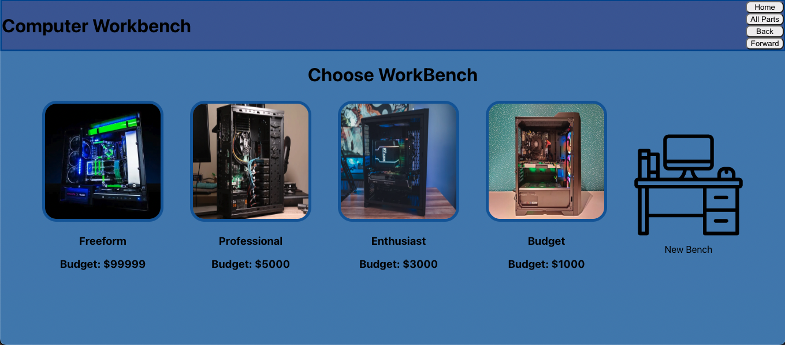

# Computer Workbench

Home Page

Part types

Part type

A filled workbench

### By: Ben Kaplan

### Date: 10/28/2022

| [GitHub](https://github.com/JBenKaplan) | [Trello](https://trello.com/b/aBLRMNPP/computer-workbench) | [LinkedIn](https://www.linkedin.com/in/jbenkaplan/) | [Deployed Site](https://computer-workbench.herokuapp.com/) |

---

## Overview

---

This application will allow you to build computers either within certain price ranges or as a free form build to see what will a completed build would be like and what you can expect as a financial investment.

## Getting Started

---

- Start your own workbench or choose a workbench you'd like to work on.
- Create a new computer build from different templates or from scratch.
- Adjust builds as you see fit and add in any parts you desire.

## Technologies Used

---

- Frontend
  - HTML
  - CSS
  - JS
  - React
  - Node JS
- Backend
  - Mongodb
  - Express
- Deployment
  - Heroku

### Future Updates

---

- [ ] More parts in list
- [ ] Login ability
- [ ] Auto populate part data from url

## Credits

---

[Icons](https://icons8.com/icons)
